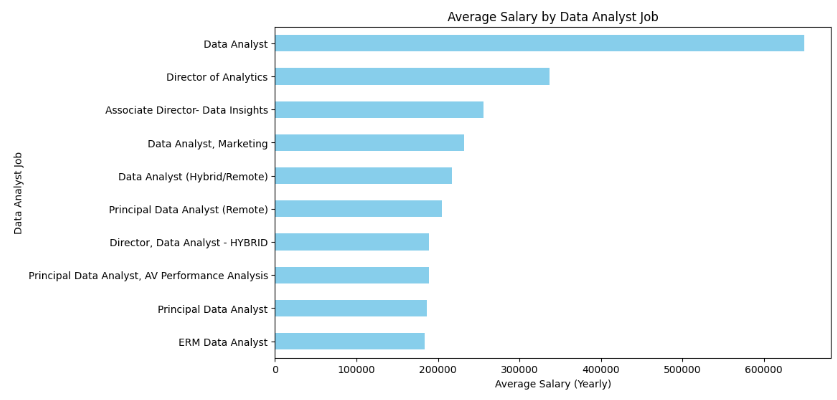

# Introduction
This project explores key trends in the data analyst job market by analyzing job postings and skill demand using SQL. The analysis identifies the most in-demand skills, highlights the highest-paying technologies, and pinpoints the top-paying job roles in the field. It also determines the optimal skillset for aspiring data analysts based on frequency and salary data. The goal is to provide actionable insights for job seekers and career planners looking to thrive in the evolving data industry.

Check SQL Queries here: [project_sql folder](/project_sql/)
# Background
This SQL project focuses on analyzing the current landscape of data analyst skills by examining trends related to the highest demand, highest paying, and most sought-after skills in the field. The goal is to identify key skills that make data analysts more competitive in the job market, explore which specific skills lead to higher-paying roles, and determine the most in-demand data analyst roles. By leveraging SQL queries to analyze job listings, salary data, and skill requirements, the project aims to provide insights into the optimal skills for data analysts to enhance their career prospects.

### Questions to be answered using SQL Queries:
1. What are the top-paying data analyst jobs?
2. What skills are required for the top-paying data analyst jobs?
3. What are the most in-demand skills for data analysts?
4. What are the top skills based on salary?
5. What are the most optimal skills to learn (high demand and high paying skills)?

# Tools Used
For this project, I utilized a variety of powerful tools to analyze and manage the data efficiently:

1. **SQL**  - was used to query, filter, and analyze large datasets. It helped in retrieving specific information about job listings, salary data, and skill requirements.

2. **PostgreSQL** - was used to store and manage the data. It provided the necessary environment to handle complex queries and ensure data integrity.

3. **VSCode** - served as the integrated development environment (IDE) for writing and executing SQL queries. 

4. **Git** - was used for version control, allowing me to track changes, manage the codebase, and collaborate effectively during the development of the project.

5. **GitHub** - hosted the project repository, providing a platform for code sharing, collaboration, and version management. It also facilitated easy access to the project’s progress and codebase for future updates or collaboration.

# Analysis
The queries in this project focus on specific aspects of the data analyst job market. Here's my approach to addressing the key areas:

### Top Paying Data Analyst Job
For this question, we will join two tables to retrieve job postings for "Data Analyst" roles located "Anywhere" with non-null salary data. The results will be filtered based on specific conditions: location, non-null salary, and "Data Analyst" roles. Then, we will sort them by salary in descending order and limit the output to the top 10 highest-paying jobs.
```sql
SELECT
        job_id,
        job_title,
        job_location,
        job_schedule_type,
        salary_year_avg,
        job_posted_date,
        B.name as company_name
FROM
        job_postings_fact AS A
LEFT JOIN company_dim AS B ON A.company_id = B.company_id
WHERE
        job_location = 'Anywhere' AND 
        salary_year_avg IS NOT NULL AND
        job_title_short = 'Data Analyst'
ORDER BY
        salary_year_avg DESC
LIMIT 10
```
Here's the visualization for the result produced using matplotlib in Python:



```python
# Import necessary libraries
import pandas as pd
import matplotlib.pyplot as plt

# Load the CSV data into a DataFrame
df = pd.read_csv("/content/sample_data/top_jobs.csv")

# Aggregate salary by job title 
salary_by_job_title = df.groupby("job_title")["salary_year_avg"].max()

# Plotting the horizontal bar graph for job titles and average salaries
plt.figure(figsize=(10, 6))
salary_by_job_title.sort_values().plot(kind='barh', color='skyblue')

# Adding labels and title
plt.xlabel('Average Salary (Yearly)')
plt.ylabel('Data Analyst Job')
plt.title('Average Salary by Data Analyst Job')

# Display the plot
plt.show()
```

Final Analysis:
- Leadership roles (e.g., Director, Associate Director) generally earn more than technical or specialized analyst roles.

- Job titles with 'Principal' or 'Director' tend to fall into higher pay brackets than titles with just "Analyst."

- Remote and hybrid jobs offer salaries on par with or slightly below in-office counterparts, reflecting ongoing flexibility in the industry without huge pay penalties.

### Top Paying Data Analyst Job Skills
For this question, we will first create a temporary table containing the top 10 highest-paying "Data Analyst" job postings based on specific conditions. Then, we join this table with skill-related data to retrieve the corresponding top skills for each job, sorting the results by salary in descending order.
```sql
WITH top_job_table AS (
    SELECT
            A.job_id,
            A.job_title,
            A.job_location,
            A.salary_year_avg,
            B.name AS company_name
    FROM
            job_postings_fact AS A
    LEFT JOIN company_dim AS B ON A.company_id = B.company_id
    WHERE
            A.job_location = 'Anywhere' AND 
            A.salary_year_avg IS NOT NULL AND
            A.job_title_short = 'Data Analyst'
    ORDER BY
            A.salary_year_avg DESC
    LIMIT 10
)

SELECT
        top_job_table.*,
        skills as top_skills
FROM
        top_job_table
INNER JOIN skills_job_dim ON top_job_table.job_id = skills_job_dim.job_id
INNER JOIN skills_dim ON skills_job_dim.skill_id = skills_dim.skill_id
ORDER BY
        salary_year_avg DESC
```
Here's the visualization produced for top skills for Data Analyst using matplotlib in Python:


```python
# Import necessary libraries
import pandas as pd
import matplotlib.pyplot as plt

# Load the CSV data into a DataFrame
df = pd.read_csv("/content/sample_data/top_paying_skills.csv")

# Aggregate salary by job title (since each job title is repeated for skills)
salary_by_job_title = df.groupby("top_skills")["salary_year_avg"].max()

# Plotting the horizontal bar graph for skills and average salaries
plt.figure(figsize=(10, 6))
salary_by_job_title.sort_values().plot(kind='barh', color='skyblue')

# Adding labels and title
plt.xlabel('Average Salary (Yearly)')
plt.ylabel('Skills')
plt.title('Average Salary by Data Analyst Skills')
```

Final Analysis:
- SQL and Python are the top two must-have skills.
- Tableau shows strong demand, reflecting the importance of data visualization.
- Tools like Snowflake, Excel, and Pandas also appear frequently, hinting at the importance of both data handling and presentation.
- Cloud and version control tools like Azure and Bitbucket are emerging in analyst roles.

### Top Demanded Data Analyst Skills
For this question, we will first create a temporary table containing the top 10 highest-paying "Data Analyst" job postings based on specific conditions. Then, we will join this table with skill-related data to retrieve the corresponding top skills for each job, sorting the results by salary in descending order.
```sql
SELECT
        skills,
        COUNT(skills_job_dim.job_id) AS skill_demand
FROM
        job_postings_fact 
INNER JOIN skills_job_dim ON job_postings_fact.job_id = skills_job_dim.job_id
INNER JOIN skills_dim ON skills_job_dim.skill_id = skills_dim.skill_id
WHERE
        job_title_short = 'Data Analyst' AND
        job_location = 'Anywhere' AND
        salary_year_avg IS NOT NULL
GROUP BY
        skills
ORDER BY
        skill_demand DESC
LIMIT 5
```
The table below displays the highest-paying skills along with their frequency of demand, based on the results obtained from the query mentioned above.

| Data Analyst Skills |  Demand Frequency |
|        :---         |       :---:       |
|         SQL         |        398        |
|        Excel        |        256        |
|        Python       |        236        |
|       Tablea        |        230        |
|          R          |        148        |

Final Analysis:
- SQL is the most in-demand skill with 398 mentions, highlighting its critical role in data handling and analysis.

- Excel, Python, and Tableau follow closely, showing strong demand for both traditional tools and modern analytics.


### Top Paying Data Analyst Skills Based on Average Salary
For this part, we will calculate the average salary for each skill associated with "Data Analyst" roles, filtering for jobs with non-null salary data. The results will be grouped by skill, ordered by average salary in descending order, and limited to the top 10 highest-paying skills.
```sql
SELECT
        skills,
        ROUND(AVG(salary_year_avg), 2) as average_salary
FROM    job_postings_fact AS A
INNER JOIN skills_job_dim AS B ON A.job_id = B.job_id
INNER JOIN skills_dim AS C ON B.skill_id = C.skill_id
WHERE
        job_title_short = 'Data Analyst' AND
        salary_year_avg IS NOT NULL
GROUP BY
        skills
ORDER BY
        average_salary DESC
LIMIT 10
SELECT
        skills,
        ROUND(AVG(salary_year_avg), 2) as average_salary
FROM    job_postings_fact AS A
INNER JOIN skills_job_dim AS B ON A.job_id = B.job_id
INNER JOIN skills_dim AS C ON B.skill_id = C.skill_id
WHERE
        job_title_short = 'Data Analyst' AND
        salary_year_avg IS NOT NULL
GROUP BY
        skills
ORDER BY
        average_salary DESC
LIMIT 10
```
The table below shows the top paying skills based on average salary associated with each skill for Data Analyst positions.

| Data Analyst Skills |   Average Salary  |
|        :---         |       :---:       |
|         svn         |     400000.00     |
|      solidity       |     179000.00     |
|      couchbase      |     160515.00     |
|      datarobot      |     155485.50     |
|        golang       |     155000.00     |
|        mxnet        |     149000.00     |
|        dplyr        |     147633.33     |
|        vmware       |     147500.00     |
|      terraform      |     146733.83     |
|        twilio       |     138500.00     |

Final Analysis:
- Niche & Emerging Tech Pays More: Skills like Solidity, MXNet, and DataRobot offer high salaries due to their rarity and relevance in cutting-edge fields like blockchain and AI/AutoML.
- Infrastructure & DevOps Are Valuable: Tools like Terraform, VMware, and Couchbase command top pay for enabling scalable, cloud-native, and secure data systems.
- Specialization Over Generalization: High salaries are linked to deep expertise in specific tools rather than broad, general-purpose skills—reflecting demand for specialized roles in modern data teams.

### Optimal Data Analyst Skills
For this question, we will write a query to calculate the demand and average salary for each skill associated with "Data Analyst" roles. The query will filter for jobs with non-null salary data and located "Anywhere." The results will be grouped by skill, include only skills with more than 10 job postings, and be ordered by average salary and demand in descending order, with the output limited to the top 5 skills.
```sql
WITH top_demand AS (
    SELECT
        skills_dim.skill_id,
        skills_dim.skills,
        COUNT(skills_job_dim.job_id) AS demanded_skills
    FROM job_postings_fact 
    INNER JOIN skills_job_dim ON job_postings_fact.job_id = skills_job_dim.job_id
    INNER JOIN skills_dim ON skills_job_dim.skill_id = skills_dim.skill_id
    WHERE
            job_title_short = 'Data Analyst' AND
            job_location = 'Anywhere' AND
            salary_year_avg IS NOT NULL
    GROUP BY
            skills_dim.skill_id
), top_salary AS (
    SELECT
        C.skill_id,
        C.skills,
        ROUND(AVG(salary_year_avg), 2) as average_salary
    FROM    job_postings_fact AS A
    INNER JOIN skills_job_dim AS B ON A.job_id = B.job_id
    INNER JOIN skills_dim AS C ON B.skill_id = C.skill_id
    WHERE
            job_title_short = 'Data Analyst' AND
            job_location = 'Anywhere' AND
            salary_year_avg IS NOT NULL
    GROUP BY
            C.skill_id
)

SELECT
        top_demand.skill_id,
        top_demand.skills,
        demanded_skills,
        average_salary
FROM    top_demand
INNER JOIN top_salary ON top_demand.skill_id = top_salary.skill_id
WHERE
        demanded_skills > 10
ORDER BY
        average_salary DESC,
        demanded_skills DESC
LIMIT 5;
```

#### Shorter way to do this:
```sql
SELECT
        skills_dim.skill_id,
        skills_dim.skills,
        COUNT(skills_job_dim.job_id) AS demanded_skills,
        ROUND(AVG(salary_year_avg), 2) as average_salary
FROM    job_postings_fact
INNER JOIN skills_job_dim ON job_postings_fact.job_id = skills_job_dim.job_id
INNER JOIN skills_dim ON skills_job_dim.skill_id = skills_dim.skill_id
WHERE
        job_title_short = 'Data Analyst' AND
        job_location = 'Anywhere' AND
        salary_year_avg IS NOT NULL
GROUP BY
        skills_dim.skill_id
HAVING
        COUNT(skills_job_dim.job_id) > 10
ORDER BY
        average_salary DESC,
        demanded_skills DESC
LIMIT 5;
```
The table below shows top 10 optimal skills for Data Analyst:
| Skill ID |   Skills   | Frequency of Demands | Average Salary |
|    :---  |   :---:    |         :---:        |      :---:     |
|     8    |     go     |          27          |    115319.89   |
|    234   | confluence |          11          |    114209.91   |
|    97    |   hadoop   |          22          |    113192.57   |
|    80    | snowflake  |          37          |    112947.97   |
|    74    |    azure   |          34          |    111225.10   |

Final Analysis:
- Snowflake stands out as the most optimal skill, with the highest demand (37) and a strong average salary (~$113K), making it a top pick for market relevance and pay.

- Azure is another optimal choice, combining high demand (34) with a solid salary (~$111K), especially valuable for cloud-focused roles.

- While Go offers the highest salary, its lower demand (27) makes it a more niche, high-risk-high-reward option compared to Snowflake or Azure.

# What I Learned
By working with SQL on these problems, I learned how to:

- Identify top-paying jobs: I filtered and sorted job listings by salary to pinpoint the highest-paying data analyst roles. SQL helped me rank jobs based on compensation data for better insights.

- Analyze required skills: I queried job listings to extract the specific skills required for top-paying data analyst jobs. This allowed me to pinpoint the skills most valued by employers.

- Determine in-demand skills: I tracked the frequency of skill mentions in job postings using SQL. This helped me identify the most in-demand skills in the data analyst field.

- Analyze skills and salary: I used SQL to correlate specific skills with higher salaries by aggregating and grouping data. This helped me identify which skills are associated with higher-paying roles.

- Find optimal skills: I combined salary and demand data in SQL to identify the best skills to learn. By analyzing both high demand and high pay, I found the most valuable skills for data analysts.

# Conclusions
Working on this project using SQL provided valuable insights into the data analyst job market and the essential skills needed for top-paying roles. It sharpened my ability to query and manipulate data, allowing me to identify trends and correlations between salary, demand, and skills. Overall, this project not only enhanced my SQL skills but also deepened my understanding of how data-driven decisions can guide career development and skill acquisition in the data analysis field.
